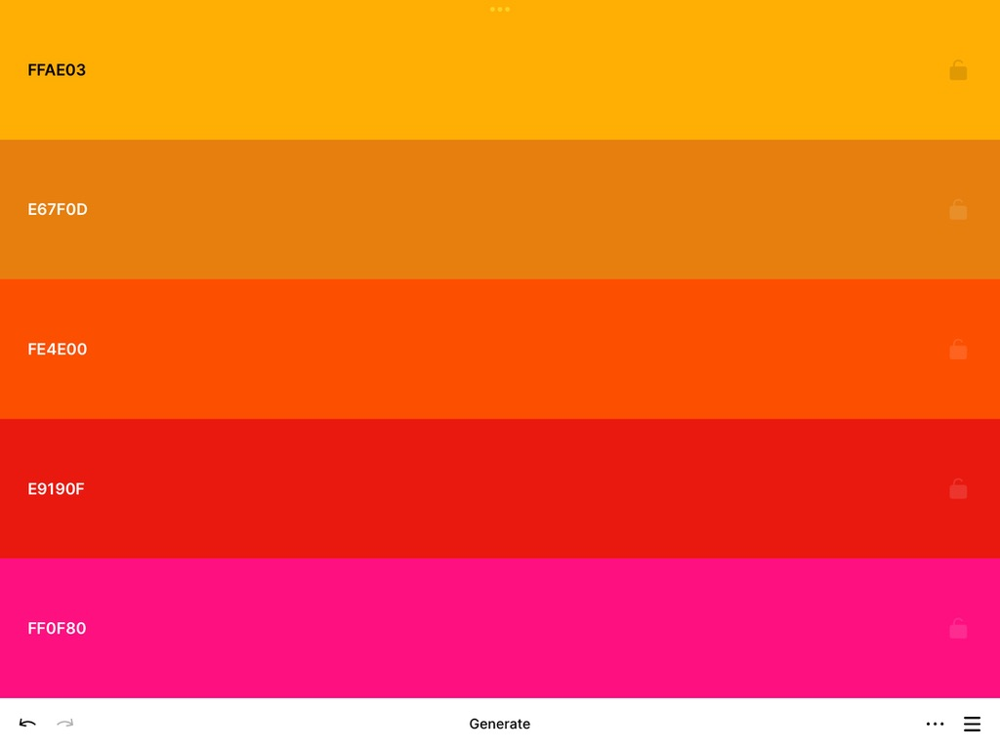

<p align='center'> 
  
</p>

<h1 align='center'>Personal Portfolio Website</h1>
<p align='center'>A modern, responsive portfolio website showcasing software development projects and skills. The site features a clean, minimalist design with smooth animations and interactive elements.</p>

## Technologies Used
- HTML5
- CSS3
- Modern CSS Features:
  - Flexbox
  - Grid
  - CSS Animations
  - CSS Variables
  - Backdrop Filter
  - 3D Transforms

## Features
- Responsive navigation bar with backdrop blur effect
- Animated hero section with 3D text effects
- Project showcase with hover animations
- Skills display section
- Social media integration
- Modern gradient color scheme
- Mobile-friendly design

## Browser Support
The website is optimized for modern browsers that support CSS3 features:
- Chrome (latest)
- Firefox (latest)
- Safari (latest)
- Edge (latest)

## Project Structure
```
personal-portfolio-website/
├── src/
│   └── assets/
│       ├── image.png          # Preview image
|       ├── color-scheme.jpeg  # Project color scheme & hex codes
|       └── favicon.svg        # Favicon image
│   └── main.css       # Stylesheet containing all styles
└── index.html          # Main HTML file
└── README.md          # Project documentation & installation guide   
```

## Execution Instructions
1. Clone or download this repository
```
gh repo clone tlklein/personal-portfolio-website
```
2. Open `index.html` in a web browser
   - For local development, using a local server is recommended to avoid CORS issues
   - You can start a simple Python server with: `python -m http.server`
   - Then visit: `http://localhost:8000`

## Customization 
You can customize the website by:
1. Modifying the color scheme in `main.css`
2. Updating project information in `index.html`
3. Adding or removing sections as needed
4. Customizing animations in the CSS file

## Main Colors Scheme
 