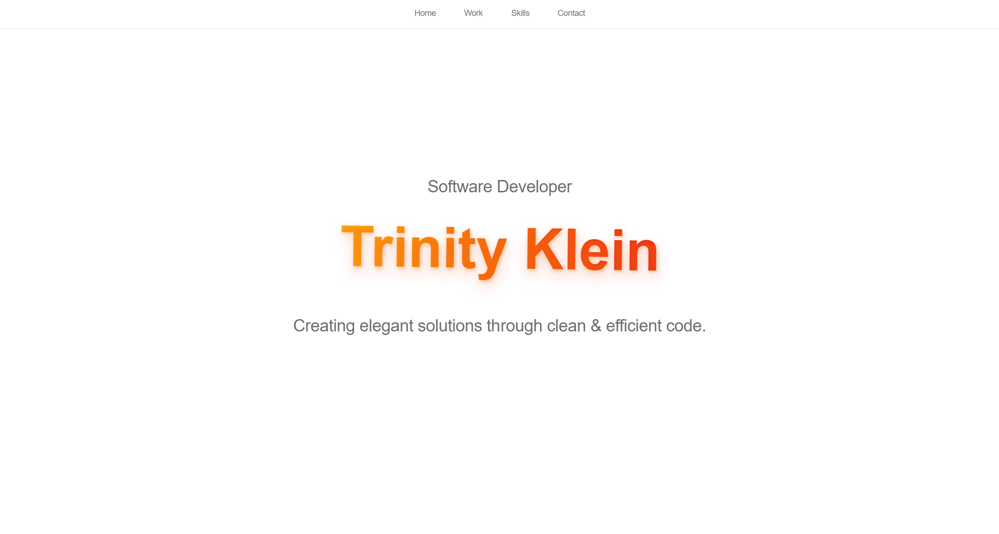

 

# Personal Portfolio Website

A modern, responsive portfolio website showcasing software development projects and skills. The site features a clean, minimalist design with smooth animations and interactive elements.

## Features

- Responsive navigation bar with backdrop blur effect
- Animated hero section with 3D text effects
- Project showcase with hover animations
- Skills display section
- Social media integration
- Modern gradient color scheme
- Mobile-friendly design

## Project Structure

```
portfolio-website/
├── index.html          # Main HTML file
├── src/
│   └── main.css       # Stylesheet containing all styles
└── README.md          # Project documentation & installation guide
└── image.png          # Preview image
└── 83A0CF27-32C8-49B9-A705-62098B96681D_1_105_c.jpeg    # Project color scheme & hex codes
```

## Getting Started

1. Clone or download this repository
2. Open `index.html` in a web browser
   - For local development, using a local server is recommended to avoid CORS issues
   - You can start a simple Python server with: `python -m http.server`
   - Then visit: `http://localhost:8000`

## Technologies Used

- HTML5
- CSS3
- Modern CSS Features:
  - Flexbox
  - Grid
  - CSS Animations
  - CSS Variables
  - Backdrop Filter
  - 3D Transforms

## Browser Support

The website is optimized for modern browsers that support CSS3 features:
- Chrome (latest)
- Firefox (latest)
- Safari (latest)
- Edge (latest)

## Customization

You can customize the website by:
1. Modifying the color scheme in `main.css`
2. Updating project information in `index.html`
3. Adding or removing sections as needed
4. Customizing animations in the CSS file


## Main Colors Scheme
 


---


## Author

Trinity Klein
- GitHub: [@tlklein](https://github.com/tlklein)
- LinkedIn: [/in/trinity-klein](https://linkedin.com/in/trinity-klein)
- Email: tlklein@cougarnet.uh.edu